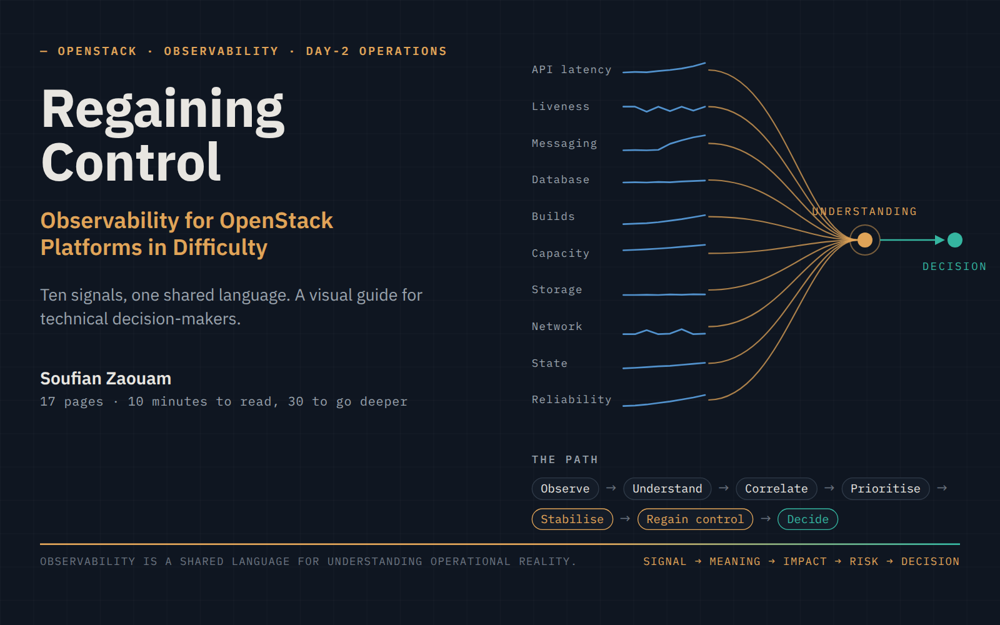
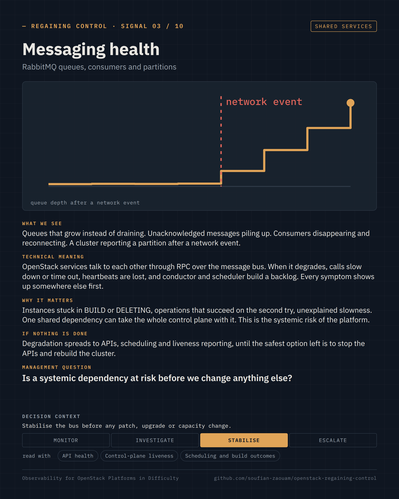

# Regaining Control

**Observability for OpenStack Platforms in Difficulty — ten signals, one shared language, a 17-page visual guide for technical decision-makers.**

[-2ea44f?style=flat-square)](Regaining-Control-Observability-for-OpenStack-Platforms-in-Difficulty.pdf)
[](https://github.com/soufian-zaouam/openstack-regaining-control/releases/latest)
[](LICENSE)
[](signals/README.md)

<a href="Regaining-Control-Observability-for-OpenStack-Platforms-in-Difficulty.pdf"></a>

> When a platform becomes difficult to operate, the first step is not to change it. It is to understand it.

## What this is

A short, visual guide about reading the operational reality of an OpenStack platform that has become difficult to understand, operate, stabilise or evolve — and about doing that *before* deciding to patch, upgrade, add capacity, rebuild or migrate it.

Its central idea is that **observability is a shared language for understanding operational reality**: not a collection of metrics, logs and dashboards, but the work of turning technical signals into an understanding that engineers and decision-makers can act on together. The guide selects **ten signals** chosen for the decision they support, reads each one through the same chain — *Signal → Meaning → Impact → Risk → Decision* — and gives a seven-step path to regain control: *Observe → Understand → Correlate → Prioritise → Stabilise → Regain control → Decide*.

It is 17 pages, one idea and one figure per page, readable in ten minutes. [The PDF](Regaining-Control-Observability-for-OpenStack-Platforms-in-Difficulty.pdf) is the guide; [`guide/`](guide/README.md) is the same content page by page; [`signals/`](signals/README.md) is where the depth is.

## Why it matters

A platform rarely fails at once. Incidents recur, performance degrades, some behaviour nobody can explain, changes become risky, the people who built it move on, and the teams that remain describe it differently depending on whom you ask. At that point the reflex is to act on the platform. But each of those actions is a change to a system nobody fully understands, and each can destroy the evidence still needed.

Engineers see queues, latencies and error rates. Decision-makers see risk, impact and priority. Both are right, and neither can act on the other's words. Most wrong decisions about a platform in difficulty — buying capacity for a messaging problem, upgrading on an unstable control plane, rebuilding what could have been read — come from that gap, not from a lack of metrics.

## Who it is for

- **First:** CTOs, CIOs, IT directors, infrastructure, cloud and platform managers, engineering managers, architects and anyone responsible for a critical platform who has to decide what happens to it without being an OpenStack specialist.
- **Then:** OpenStack, cloud, SRE and platform engineers who need a vocabulary to explain a platform's state to the people who decide.

It does not try to make the reader an OpenStack expert. It lets them understand what is happening, why it matters, what the risk is, what is known and unknown, what should be investigated or stabilised first, and what information is needed before a decision.

## What you will learn

| Page | You will be able to… | Figure |
| --- | --- | --- |
| 02–04 | recognise a platform in difficulty, see why understanding must come before change, and read any signal through *Signal → Meaning → Impact → Risk → Decision* | the two paths · the bridge · one signal, two languages |
| 05–10 | ask about the **ten signals** that are enough to read a platform, each with what it means, why it matters, the question to ask and the decision it supports | the platform map · ten KPI cards |
| 11–13 | correlate signals instead of reacting to one metric, follow a production scenario from reflex to reading, and tell a dashboard from a decision view | convergence · a six-week timeline · dashboard vs decision view |
| 14–16 | run the seven steps that regain control, decide what can safely change (and what must be stabilised first), keep eight principles | the method · the decision tree · eight principles |

The **ten signals**: API health · Control-plane liveness · Messaging health · Database health · Scheduling and build outcomes · Capacity headroom · Storage health and latency · Network data path and agents · Workload state integrity · Reliability trend. Why these ten, and not fifty, is in [`signals/README.md`](signals/README.md), together with the signals deliberately left out.

<p align="center">
  <a href="guide/07-signals-messaging-and-database.md"></a>
  <br>
  <sub>Every signal is a card with the same six blocks, generated from its YAML source. Above: signal 03, messaging health.</sub>
</p>

## Why it was created

Most material about OpenStack observability explains which metrics to collect and how to build dashboards. Very little explains what those metrics mean for the person who has to decide whether the platform can be patched, upgraded, expanded or left alone — and almost nothing gives engineers and decision-makers the same words for the same reality.

This guide comes from operating OpenStack platforms in production: the moment when a platform is "slower every month", when the proposal on the table is to add hardware or bring an upgrade forward, and when the signals, read together, say something else. It is a personal contribution, written to be shared inside an organisation as a reading grid, and it is part of a series on operating OpenStack in production (see [Related work](#related-work)).

## Map of the repository

```text
README.md                                   this page
Regaining-Control-…-in-Difficulty.pdf       the guide (A4, 17 pages), also attached to each release
guide/                                      the guide page by page, one Markdown file per PDF page
  README.md                                 contents, the five-minute path
signals/                                    the ten signals, the source of the KPI cards
  README.md                                 selection criteria, the signals left out, how a card is read
  01-api-health.yaml … 10-reliability-trend.yaml
figures/                                    the rendered figures (PNG, 1600 × 1000), reused by the guide, the PDF and LinkedIn
  cards/                                    the ten KPI cards (PNG, 1080 × 1350)
assets/                                     the visual identity: palette, typography, social preview
src/                                        how it is built
  content/meta.yaml                         title, author, cover and closing page
  figures/NN-slug.html                      one figure per file (HTML/SVG on the figure system)
  templates/ · styles/                      page, card and figure templates; design tokens
  render/                                   render_figures.py · render_cards.py · build_pages.py · build_pdf.py
Makefile                                    make figures · cards · pages · pdf · all
.github/                                    build workflow, issue templates
```

## How to read it

1. **Ten minutes:** open [the PDF](Regaining-Control-Observability-for-OpenStack-Platforms-in-Difficulty.pdf) and read the titles, the key messages and the figures. That is the guide.
2. **Five minutes, if that is all you have:** pages 02, 03, 05, 11, 13, 14 and 17.
3. **Thirty minutes:** read the ten cards (pages 06–10), then the [selection criteria and the signals left out](signals/README.md), then the sources cited under each signal.
4. **With your team:** put the ten cards next to your own platform. For each signal, ask whether someone reads it, whether it can be walked through the chain, and who owns it. The answers are the assessment.

## How it is built

Everything in the PDF has a source that can be edited: the text of pages 02–05 and 11–16 in [`guide/`](guide/), the ten signals in [`signals/`](signals/), the cover and closing page in [`src/content/meta.yaml`](src/content/meta.yaml), and each figure in [`src/figures/`](src/figures/) as HTML and SVG on a small figure system ([`src/styles/`](src/styles/)). Chromium renders all of it, through [Playwright](https://playwright.dev/python/): figures and cards to PNG, the seventeen pages to a PDF with real text, bookmarks and metadata.

```bash
pip install -r requirements.txt && python3 -m playwright install chromium
make all        # figures, cards, generated pages, PDF
make pdf        # the PDF only
```

The images and the PDF are generated files. Edit the source, run `make`, commit the result; the [workflow](.github/workflows/build.yml) rebuilds them on `main` when a source changes and attaches the PDF to each release. IBM Plex Sans and IBM Plex Mono are expected on the machine (`fonts-ibm-plex` on Debian and Ubuntu); the build falls back to DejaVu without them.

## Scope

- **Decision-oriented, not exhaustive.** Ten signals, not a catalogue. The metrics behind each signal, the exporters, the dashboards and the commands are deliberately out of scope; several are covered in the [Production Guide](https://github.com/soufian-zaouam/openstack-production-guide).
- **Technically exact, deployment-neutral.** The signals exist whatever the distribution or deployment tool. Where behaviour depends on a release or a backend, the sources under each signal say so.
- **Generic by construction.** The production scenario is a composite of recurring patterns; no organisation, platform or person is described or identifiable. Numbers in the figures are illustrative shapes, not measurements.
- **A reading grid, not a benchmark.** It says which signals to read together and which decision each one supports; it does not set thresholds, which belong to each platform.

## Related work

- **[OpenStack, the Day After Tomorrow — Operating Mission-Critical OpenStack Platforms](https://github.com/soufian-zaouam/openstack-the-day-after-tomorrow)** — the book: why control over a platform erodes, how to assess it and how to keep it. Its [Short Guide](https://github.com/soufian-zaouam/openstack-the-day-after-tomorrow-guide) gives the ideas in 18 illustrated pages.
- **[OpenStack Production Guide](https://github.com/soufian-zaouam/openstack-production-guide)** — the practice: troubleshooting by symptom, by command and by error message, the *One Command, One Investigation* series, and anonymised incident cases in RCA format. The messaging, storage and reliability signals of this guide cite its cases.

The book explains why; the Production Guide gives the checks and the cases; this guide gives decision-makers the signals and the language.

## Contributing

Corrections, challenges to a signal, a signal you would have chosen instead, a source that says it better: see [CONTRIBUTING.md](CONTRIBUTING.md) or open an issue with one of the templates. The [CHANGELOG](CHANGELOG.md) records what changed in each release.

## License

The guide, its pages and its figures are licensed under the [Creative Commons Attribution-NonCommercial-NoDerivatives 4.0 International License](LICENSE) (CC BY-NC-ND 4.0): share it, inside your organisation or beyond, with attribution and without modification or commercial use. The build scripts in `src/render/` and the styles in `src/styles/` may be reused under the same terms to rebuild this work. To cite it, see [CITATION.cff](CITATION.cff).

This is an independent work. It is not affiliated with, sponsored by or endorsed by the OpenInfra Foundation or any OpenStack project team. OpenStack is a trademark of the OpenStack Foundation d/b/a Open Infrastructure Foundation.

## Author

**Soufian Zaouam** — platform engineer, Day-2 operations of mission-critical OpenStack platforms; author of *[OpenStack, the Day After Tomorrow](https://github.com/soufian-zaouam/openstack-the-day-after-tomorrow)*. [LinkedIn](https://www.linkedin.com/in/soufian-zaouam)

*Is your OpenStack platform becoming difficult to understand, operate or evolve? Before changing the platform, understand it. Let's talk about what the signals are telling you.*
