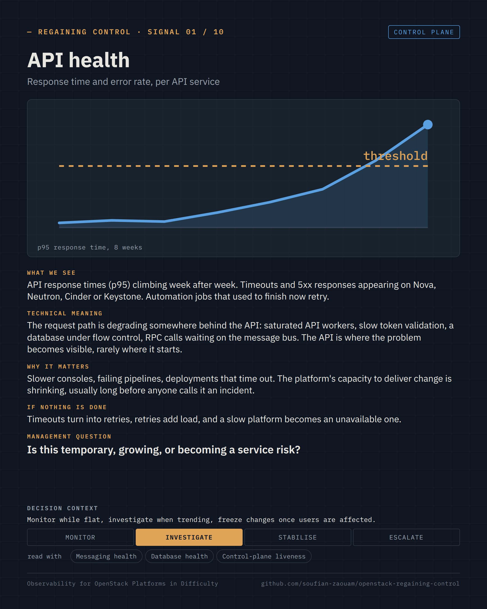
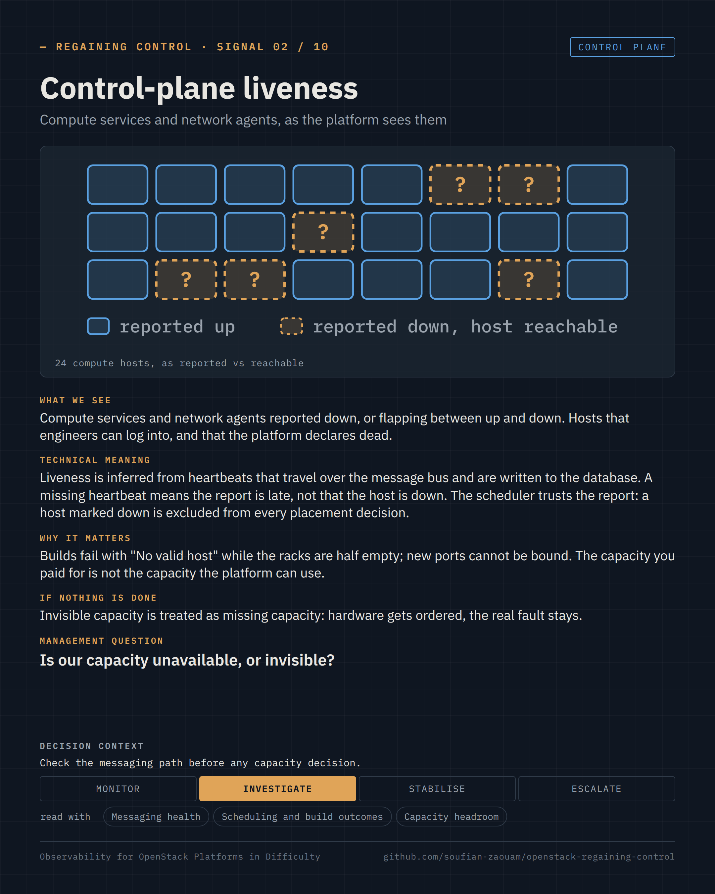

Regaining Control · Observability for OpenStack Platforms in Difficulty · page 06 of 17

<!-- Generated by src/render/build_pages.py from signals/*.yaml. Edit the source, then run `make pages`. -->

# 06 · API health · Control-plane liveness

*The signals · 01–02 / 10*

**Is the platform responding, and is the capacity it reports real?**

Two signals per page, one card each: what we see, what it means, why it matters, what happens if nothing is done, the question a decision-maker can ask, and the decision it supports. The cards are generated from [`signals/`](../signals/); the selection criteria and the signals left out are in [`signals/README.md`](../signals/README.md).

### Signal 01 · API health

*Response time and error rate, per API service* · Control plane

**What we see.** API response times (p95) climbing week after week. Timeouts and 5xx responses appearing on Nova, Neutron, Cinder or Keystone. Automation jobs that used to finish now retry.

**Technical meaning.** The request path is degrading somewhere behind the API: saturated API workers, slow token validation, a database under flow control, RPC calls waiting on the message bus. The API is where the problem becomes visible, rarely where it starts.

**Why it matters.** Slower consoles, failing pipelines, deployments that time out. The platform's capacity to deliver change is shrinking, usually long before anyone calls it an incident.

**If nothing is done.** Timeouts turn into retries, retries add load, and a slow platform becomes an unavailable one.

**Management question.** *Is this temporary, growing, or becoming a service risk?*

**Decision context.** Monitor · **Investigate** · Stabilise · Escalate — Monitor while flat, investigate when trending, freeze changes once users are affected.

**Read with.** Messaging health · Database health · Control-plane liveness

**Sources.** [oslo.messaging — RPC timeouts and the message bus every API call depends on](https://docs.openstack.org/oslo.messaging/latest/) · [Keystone — token validation on every authenticated request](https://docs.openstack.org/keystone/latest/admin/tokens-overview.html) · [OpenStack Large Scale SIG — scaling the control plane](https://wiki.openstack.org/wiki/Large_Scale_SIG)

### Signal 02 · Control-plane liveness

*Compute services and network agents, as the platform sees them* · Control plane

**What we see.** Compute services and network agents reported down, or flapping between up and down. Hosts that engineers can log into, and that the platform declares dead.

**Technical meaning.** Liveness is inferred from heartbeats that travel over the message bus and are written to the database. A missing heartbeat means the report is late, not that the host is down. The scheduler trusts the report: a host marked down is excluded from every placement decision.

**Why it matters.** Builds fail with "No valid host" while the racks are half empty; new ports cannot be bound. The capacity you paid for is not the capacity the platform can use.

**If nothing is done.** Invisible capacity is treated as missing capacity: hardware gets ordered, the real fault stays.

**Management question.** *Is our capacity unavailable, or invisible?*

**Decision context.** Monitor · **Investigate** · Stabilise · Escalate — Check the messaging path before any capacity decision.

**Read with.** Messaging health · Scheduling and build outcomes · Capacity headroom

**Sources.** [Nova — ComputeFilter: only hosts reported operational and enabled are candidates](https://docs.openstack.org/nova/latest/admin/scheduling.html) · [Nova — service_down_time: the heartbeat window that decides up or down](https://docs.openstack.org/nova/latest/configuration/config.html#DEFAULT.service_down_time) · [Neutron — agent_down_time and agent liveness reporting](https://docs.openstack.org/neutron/latest/configuration/neutron.html#DEFAULT.agent_down_time)

---

[← 05 · Ten signals, one platform](05-ten-signals-one-platform.md) &nbsp;·&nbsp; [Contents](README.md#contents) &nbsp;·&nbsp; [07 · Signals 03–04 · Messaging health · Database health →](07-signals-messaging-and-database.md)
