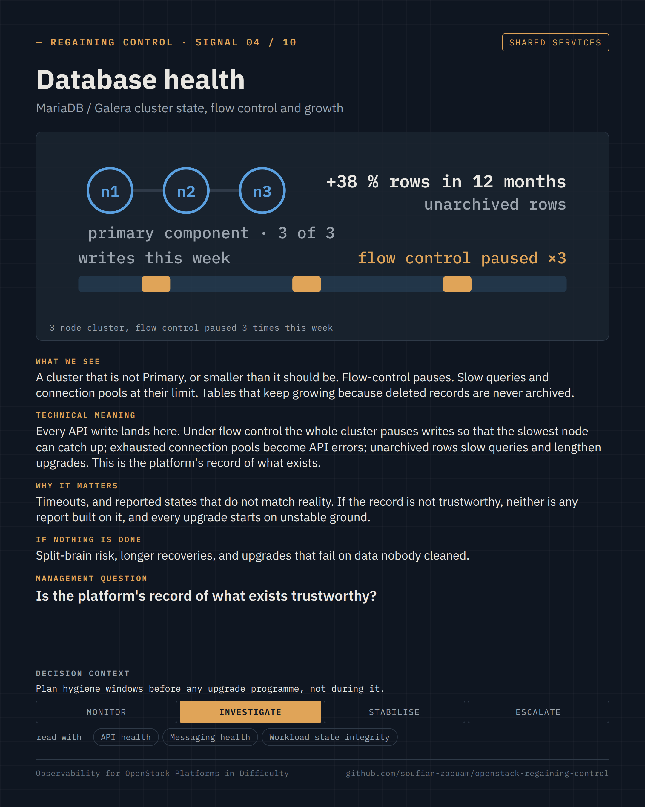

Regaining Control · Observability for OpenStack Platforms in Difficulty · page 07 of 17

<!-- Generated by src/render/build_pages.py from signals/*.yaml. Edit the source, then run `make pages`. -->

# 07 · Messaging health · Database health

*The signals · 03–04 / 10*

**The two shared dependencies every operation relies on.**

Two signals per page, one card each: what we see, what it means, why it matters, what happens if nothing is done, the question a decision-maker can ask, and the decision it supports. The cards are generated from [`signals/`](../signals/); the selection criteria and the signals left out are in [`signals/README.md`](../signals/README.md).

### Signal 03 · Messaging health

*RabbitMQ queues, consumers and partitions* · Shared services

**What we see.** Queues that grow instead of draining. Unacknowledged messages piling up. Consumers disappearing and reconnecting. A cluster reporting a partition after a network event.

**Technical meaning.** OpenStack services talk to each other through RPC over the message bus. When it degrades, calls slow down or time out, heartbeats are lost, and conductor and scheduler build a backlog. Every symptom shows up somewhere else first.

**Why it matters.** Instances stuck in BUILD or DELETING, operations that succeed on the second try, unexplained slowness. One shared dependency can take the whole control plane with it. This is the systemic risk of the platform.

**If nothing is done.** Degradation spreads to APIs, scheduling and liveness reporting, until the safest option left is to stop the APIs and rebuild the cluster.

**Management question.** *Is a systemic dependency at risk before we change anything else?*

**Decision context.** Monitor · Investigate · **Stabilise** · Escalate — Stabilise the bus before any patch, upgrade or capacity change.

**Read with.** API health · Control-plane liveness · Scheduling and build outcomes

**Sources.** [RabbitMQ — clustering and network partitions](https://www.rabbitmq.com/docs/partitions) · [oslo.messaging — RabbitMQ driver, heartbeats and timeouts](https://docs.openstack.org/oslo.messaging/latest/admin/rabbit.html) · [OpenStack Production Guide — RabbitMQ partition: stopping the APIs (anonymised case)](https://github.com/soufian-zaouam/openstack-production-guide/blob/main/incidents/rabbitmq-partition-api-stop.md)

### Signal 04 · Database health

*MariaDB / Galera cluster state, flow control and growth* · Shared services

**What we see.** A cluster that is not Primary, or smaller than it should be. Flow-control pauses. Slow queries and connection pools at their limit. Tables that keep growing because deleted records are never archived.

**Technical meaning.** Every API write lands here. Under flow control the whole cluster pauses writes so that the slowest node can catch up; exhausted connection pools become API errors; unarchived rows slow queries and lengthen upgrades. This is the platform's record of what exists.

**Why it matters.** Timeouts, and reported states that do not match reality. If the record is not trustworthy, neither is any report built on it, and every upgrade starts on unstable ground.

**If nothing is done.** Split-brain risk, longer recoveries, and upgrades that fail on data nobody cleaned.

**Management question.** *Is the platform's record of what exists trustworthy?*

**Decision context.** Monitor · **Investigate** · Stabilise · Escalate — Plan hygiene windows before any upgrade programme, not during it.

**Read with.** API health · Messaging health · Workload state integrity

**Sources.** [Galera Cluster — understanding flow control](https://galeracluster.com/library/kb/understanding-flow-control.html) · [Galera Cluster — node state and cluster status (Primary component)](https://galeracluster.com/library/documentation/node-states.html) · [nova-manage db archive_deleted_rows — archiving soft-deleted records](https://docs.openstack.org/nova/latest/cli/nova-manage.html#nova-database)

---

[← 06 · Signals 01–02 · API health · Control-plane liveness](06-signals-api-health-and-liveness.md) &nbsp;·&nbsp; [Contents](README.md#contents) &nbsp;·&nbsp; [08 · Signals 05–06 · Scheduling and build outcomes · Capacity headroom →](08-signals-scheduling-and-capacity.md)
