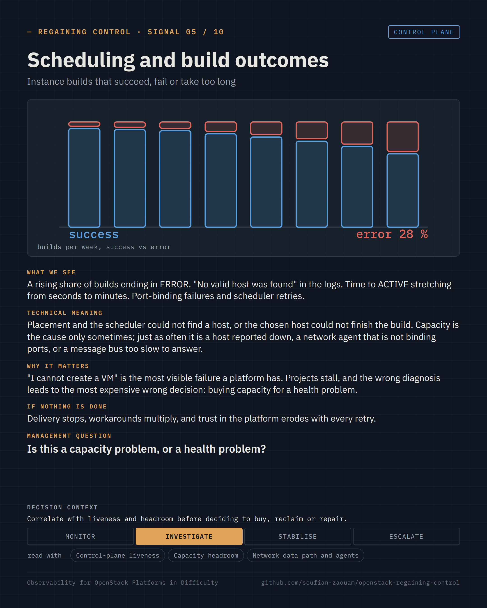
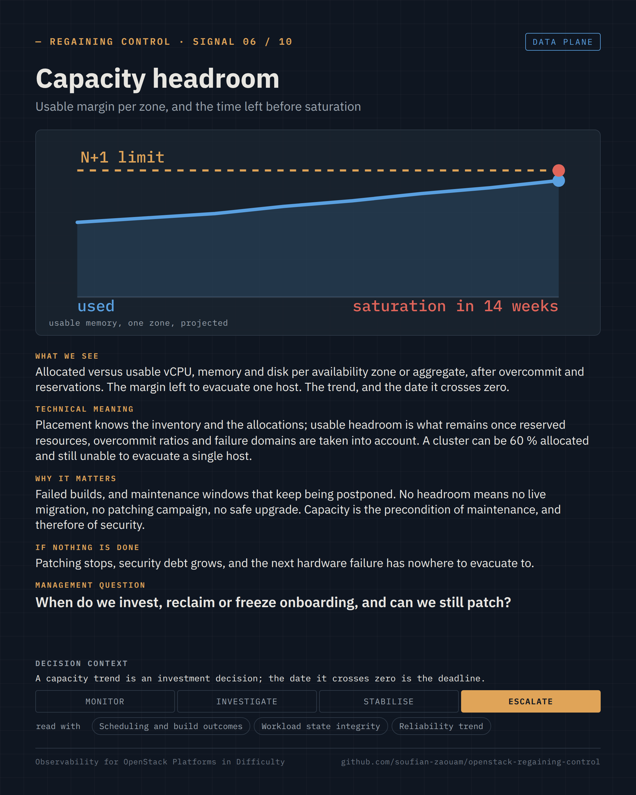

Regaining Control · Observability for OpenStack Platforms in Difficulty · page 08 of 17

<!-- Generated by src/render/build_pages.py from signals/*.yaml. Edit the source, then run `make pages`. -->

# 08 · Scheduling and build outcomes · Capacity headroom

*The signals · 05–06 / 10*

**Capacity problem, or health problem?**

Two signals per page, one card each: what we see, what it means, why it matters, what happens if nothing is done, the question a decision-maker can ask, and the decision it supports. The cards are generated from [`signals/`](../signals/); the selection criteria and the signals left out are in [`signals/README.md`](../signals/README.md).

### Signal 05 · Scheduling and build outcomes

*Instance builds that succeed, fail or take too long* · Control plane

**What we see.** A rising share of builds ending in ERROR. "No valid host was found" in the logs. Time to ACTIVE stretching from seconds to minutes. Port-binding failures and scheduler retries.

**Technical meaning.** Placement and the scheduler could not find a host, or the chosen host could not finish the build. Capacity is the cause only sometimes; just as often it is a host reported down, a network agent that is not binding ports, or a message bus too slow to answer.

**Why it matters.** "I cannot create a VM" is the most visible failure a platform has. Projects stall, and the wrong diagnosis leads to the most expensive wrong decision: buying capacity for a health problem.

**If nothing is done.** Delivery stops, workarounds multiply, and trust in the platform erodes with every retry.

**Management question.** *Is this a capacity problem, or a health problem?*

**Decision context.** Monitor · **Investigate** · Stabilise · Escalate — Correlate with liveness and headroom before deciding to buy, reclaim or repair.

**Read with.** Control-plane liveness · Capacity headroom · Network data path and agents

**Sources.** [Nova — the scheduler, filters and why a host is rejected](https://docs.openstack.org/nova/latest/admin/scheduling.html) · [Placement — resource providers, inventories and allocation candidates](https://docs.openstack.org/placement/latest/user/index.html) · [Neutron — port binding and the vif_type 'binding_failed' outcome](https://docs.openstack.org/neutron/latest/admin/config-ml2.html)

### Signal 06 · Capacity headroom

*Usable margin per zone, and the time left before saturation* · Data plane

**What we see.** Allocated versus usable vCPU, memory and disk per availability zone or aggregate, after overcommit and reservations. The margin left to evacuate one host. The trend, and the date it crosses zero.

**Technical meaning.** Placement knows the inventory and the allocations; usable headroom is what remains once reserved resources, overcommit ratios and failure domains are taken into account. A cluster can be 60 % allocated and still unable to evacuate a single host.

**Why it matters.** Failed builds, and maintenance windows that keep being postponed. No headroom means no live migration, no patching campaign, no safe upgrade. Capacity is the precondition of maintenance, and therefore of security.

**If nothing is done.** Patching stops, security debt grows, and the next hardware failure has nowhere to evacuate to.

**Management question.** *When do we invest, reclaim or freeze onboarding, and can we still patch?*

**Decision context.** Monitor · Investigate · Stabilise · **Escalate** — A capacity trend is an investment decision; the date it crosses zero is the deadline.

**Read with.** Scheduling and build outcomes · Workload state integrity · Reliability trend

**Sources.** [Placement — inventories, reserved resources and allocation ratios](https://docs.openstack.org/placement/latest/user/provider-tree.html) · [Nova — host aggregates and availability zones](https://docs.openstack.org/nova/latest/admin/aggregates.html) · [Nova — cpu_allocation_ratio, ram_allocation_ratio, reserved_host_memory_mb](https://docs.openstack.org/nova/latest/configuration/config.html#DEFAULT.cpu_allocation_ratio)

---

[← 07 · Signals 03–04 · Messaging health · Database health](07-signals-messaging-and-database.md) &nbsp;·&nbsp; [Contents](README.md#contents) &nbsp;·&nbsp; [09 · Signals 07–08 · Storage health and latency · Network data path and agents →](09-signals-storage-and-network.md)
