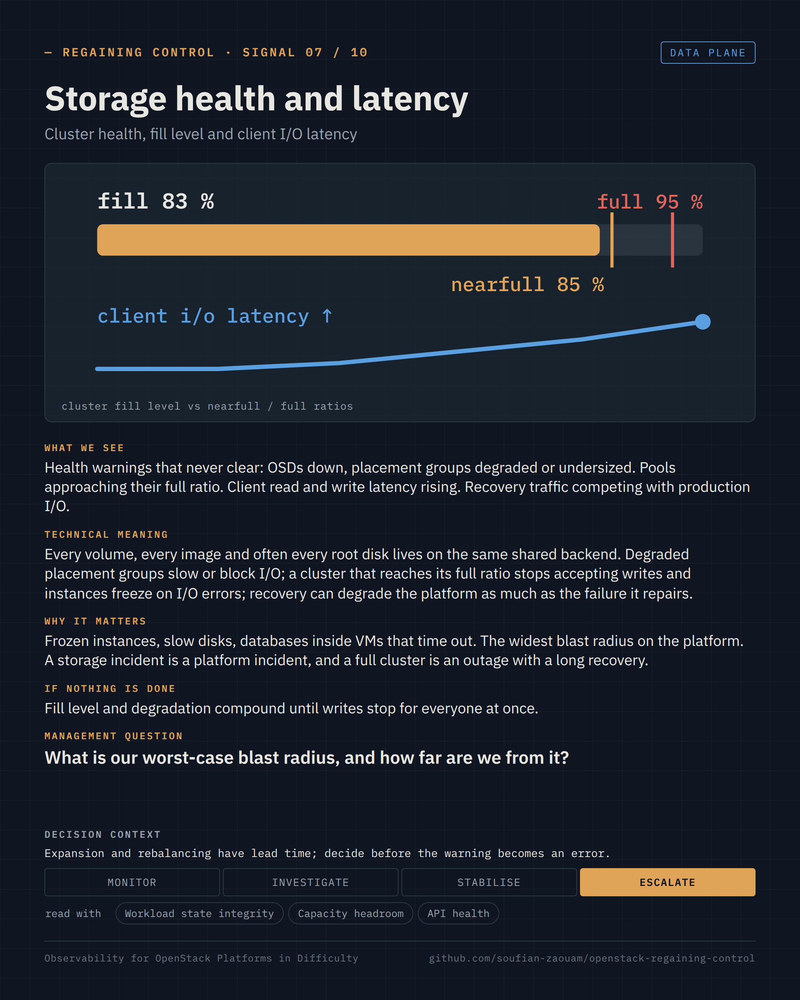
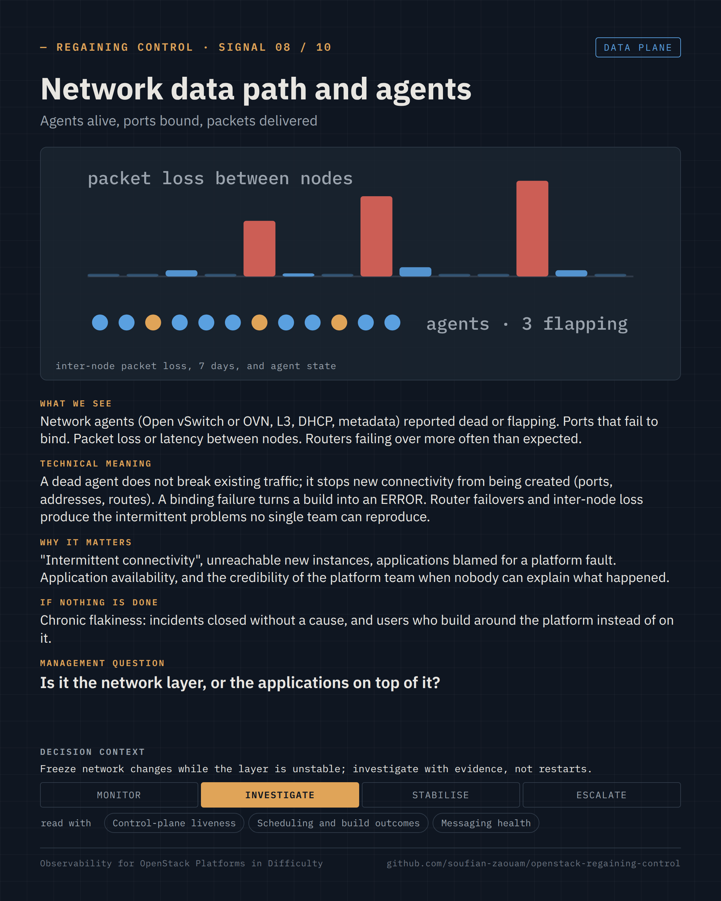

Regaining Control · Observability for OpenStack Platforms in Difficulty · page 09 of 17

<!-- Generated by src/render/build_pages.py from signals/*.yaml. Edit the source, then run `make pages`. -->

# 09 · Storage health and latency · Network data path and agents

*The signals · 07–08 / 10*

**The layers with the widest blast radius.**

Two signals per page, one card each: what we see, what it means, why it matters, what happens if nothing is done, the question a decision-maker can ask, and the decision it supports. The cards are generated from [`signals/`](../signals/); the selection criteria and the signals left out are in [`signals/README.md`](../signals/README.md).

### Signal 07 · Storage health and latency

*Cluster health, fill level and client I/O latency* · Data plane

**What we see.** Health warnings that never clear: OSDs down, placement groups degraded or undersized. Pools approaching their full ratio. Client read and write latency rising. Recovery traffic competing with production I/O.

**Technical meaning.** Every volume, every image and often every root disk lives on the same shared backend. Degraded placement groups slow or block I/O; a cluster that reaches its full ratio stops accepting writes and instances freeze on I/O errors; recovery can degrade the platform as much as the failure it repairs.

**Why it matters.** Frozen instances, slow disks, databases inside VMs that time out. The widest blast radius on the platform. A storage incident is a platform incident, and a full cluster is an outage with a long recovery.

**If nothing is done.** Fill level and degradation compound until writes stop for everyone at once.

**Management question.** *What is our worst-case blast radius, and how far are we from it?*

**Decision context.** Monitor · Investigate · Stabilise · **Escalate** — Expansion and rebalancing have lead time; decide before the warning becomes an error.

**Read with.** Workload state integrity · Capacity headroom · API health

**Sources.** [Ceph — health checks (OSD_DOWN, PG_DEGRADED, POOL_NEAR_FULL, OSD_FULL)](https://docs.ceph.com/en/latest/rados/operations/health-checks/) · [Ceph — storage capacity, nearfull and full ratios, what happens when writes stop](https://docs.ceph.com/en/latest/rados/configuration/mon-config-ref/#storage-capacity) · [OpenStack Production Guide — Ceph full OSD and CRUSH weights (anonymised case)](https://github.com/soufian-zaouam/openstack-production-guide/blob/main/incidents/ceph-full-osd-crush-weights.md)

### Signal 08 · Network data path and agents

*Agents alive, ports bound, packets delivered* · Data plane

**What we see.** Network agents (Open vSwitch or OVN, L3, DHCP, metadata) reported dead or flapping. Ports that fail to bind. Packet loss or latency between nodes. Routers failing over more often than expected.

**Technical meaning.** A dead agent does not break existing traffic; it stops new connectivity from being created (ports, addresses, routes). A binding failure turns a build into an ERROR. Router failovers and inter-node loss produce the intermittent problems no single team can reproduce.

**Why it matters.** "Intermittent connectivity", unreachable new instances, applications blamed for a platform fault. Application availability, and the credibility of the platform team when nobody can explain what happened.

**If nothing is done.** Chronic flakiness: incidents closed without a cause, and users who build around the platform instead of on it.

**Management question.** *Is it the network layer, or the applications on top of it?*

**Decision context.** Monitor · **Investigate** · Stabilise · Escalate — Freeze network changes while the layer is unstable; investigate with evidence, not restarts.

**Read with.** Control-plane liveness · Scheduling and build outcomes · Messaging health

**Sources.** [Neutron — agent management and high availability of L3 routers](https://docs.openstack.org/neutron/latest/admin/deploy-ovs-ha-vrrp.html) · [Neutron — OVN driver architecture and the absence of per-node agents](https://docs.openstack.org/neutron/latest/ovn/index.html) · [Neutron — ML2 port binding](https://docs.openstack.org/neutron/latest/admin/config-ml2.html)

---

[← 08 · Signals 05–06 · Scheduling and build outcomes · Capacity headroom](08-signals-scheduling-and-capacity.md) &nbsp;·&nbsp; [Contents](README.md#contents) &nbsp;·&nbsp; [10 · Signals 09–10 · Workload state integrity · Reliability trend →](10-signals-state-integrity-and-reliability.md)
