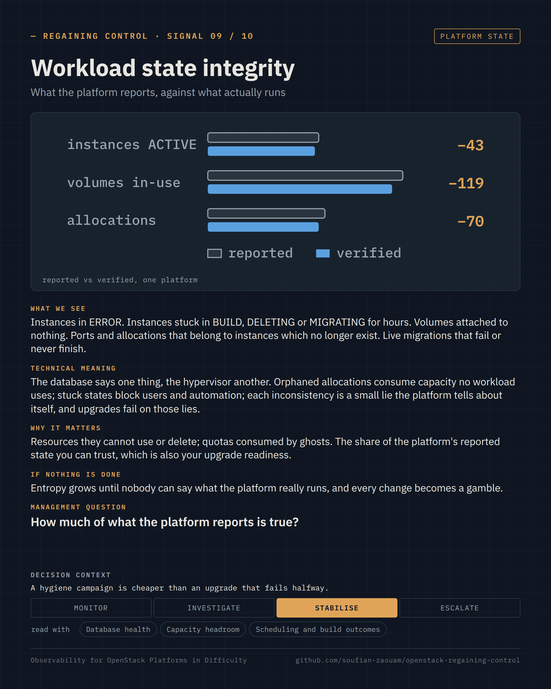
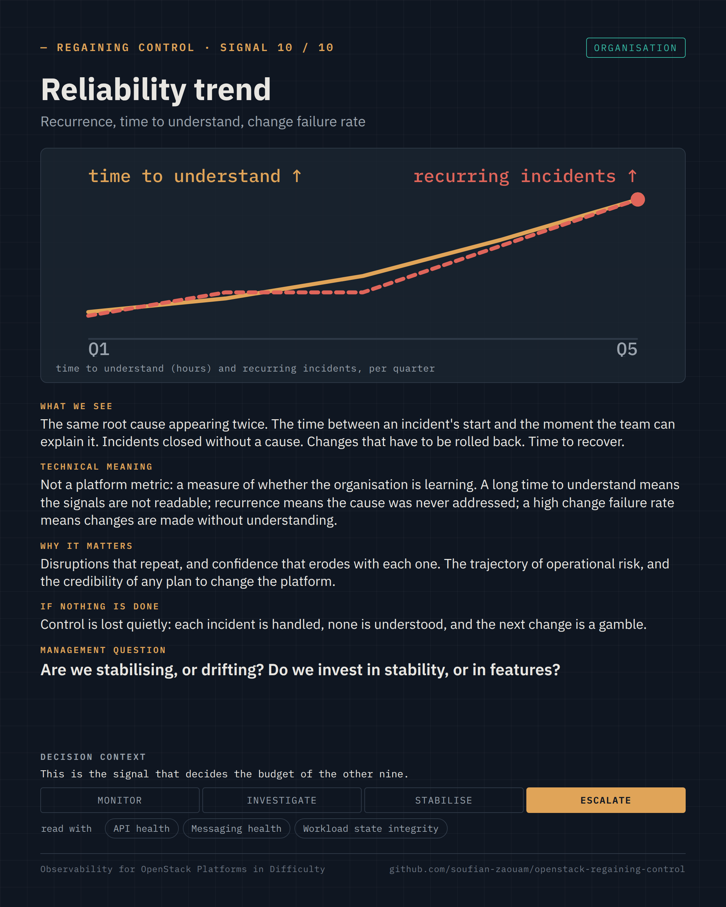

Regaining Control · Observability for OpenStack Platforms in Difficulty · page 10 of 17

<!-- Generated by src/render/build_pages.py from signals/*.yaml. Edit the source, then run `make pages`. -->

# 10 · Workload state integrity · Reliability trend

*The signals · 09–10 / 10*

**Is what the platform reports true? Are we stabilising, or drifting?**

Two signals per page, one card each: what we see, what it means, why it matters, what happens if nothing is done, the question a decision-maker can ask, and the decision it supports. The cards are generated from [`signals/`](../signals/); the selection criteria and the signals left out are in [`signals/README.md`](../signals/README.md).

### Signal 09 · Workload state integrity

*What the platform reports, against what actually runs* · Platform state

**What we see.** Instances in ERROR. Instances stuck in BUILD, DELETING or MIGRATING for hours. Volumes attached to nothing. Ports and allocations that belong to instances which no longer exist. Live migrations that fail or never finish.

**Technical meaning.** The database says one thing, the hypervisor another. Orphaned allocations consume capacity no workload uses; stuck states block users and automation; each inconsistency is a small lie the platform tells about itself, and upgrades fail on those lies.

**Why it matters.** Resources they cannot use or delete; quotas consumed by ghosts. The share of the platform's reported state you can trust, which is also your upgrade readiness.

**If nothing is done.** Entropy grows until nobody can say what the platform really runs, and every change becomes a gamble.

**Management question.** *How much of what the platform reports is true?*

**Decision context.** Monitor · Investigate · **Stabilise** · Escalate — A hygiene campaign is cheaper than an upgrade that fails halfway.

**Read with.** Database health · Capacity headroom · Scheduling and build outcomes

**Sources.** [Nova — instance states (vm_state, task_state) and transitions](https://docs.openstack.org/nova/latest/reference/vm-states.html) · [nova-manage placement heal_allocations / audit — orphaned and missing allocations](https://docs.openstack.org/nova/latest/cli/nova-manage.html#placement) · [cinder-manage — volume state repair and attachment consistency](https://docs.openstack.org/cinder/latest/cli/cinder-manage.html)

### Signal 10 · Reliability trend

*Recurrence, time to understand, change failure rate* · Organisation

**What we see.** The same root cause appearing twice. The time between an incident's start and the moment the team can explain it. Incidents closed without a cause. Changes that have to be rolled back. Time to recover.

**Technical meaning.** Not a platform metric: a measure of whether the organisation is learning. A long time to understand means the signals are not readable; recurrence means the cause was never addressed; a high change failure rate means changes are made without understanding.

**Why it matters.** Disruptions that repeat, and confidence that erodes with each one. The trajectory of operational risk, and the credibility of any plan to change the platform.

**If nothing is done.** Control is lost quietly: each incident is handled, none is understood, and the next change is a gamble.

**Management question.** *Are we stabilising, or drifting? Do we invest in stability, or in features?*

**Decision context.** Monitor · Investigate · Stabilise · **Escalate** — This is the signal that decides the budget of the other nine.

**Read with.** API health · Messaging health · Workload state integrity

**Sources.** [Site Reliability Engineering — Postmortem culture: learning from failure](https://sre.google/sre-book/postmortem-culture/) · [DORA — the four key metrics, including change failure rate and time to restore](https://dora.dev/guides/dora-metrics-four-keys/) · [OpenStack Production Guide — root cause analysis and the incident record template](https://github.com/soufian-zaouam/openstack-production-guide/blob/main/methodology/root-cause-analysis.md)

---

[← 09 · Signals 07–08 · Storage health and latency · Network data path and agents](09-signals-storage-and-network.md) &nbsp;·&nbsp; [Contents](README.md#contents) &nbsp;·&nbsp; [11 · Why one metric is not enough →](11-why-one-metric-is-not-enough.md)
